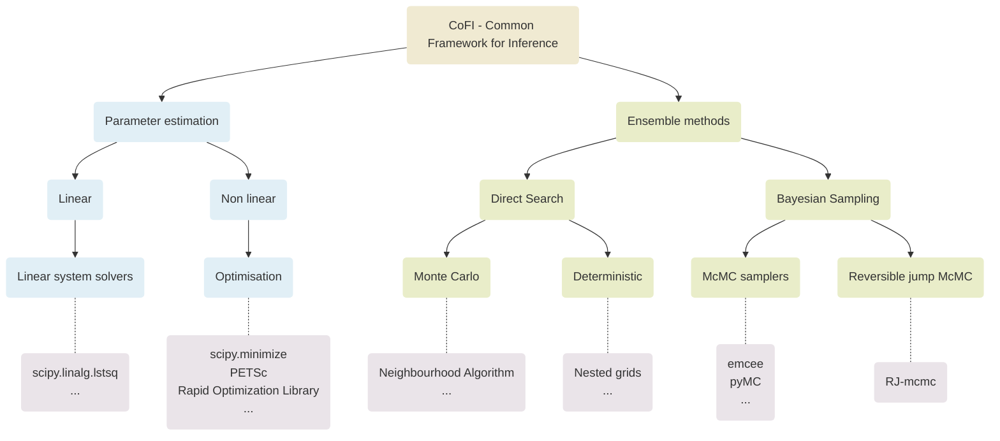

#  CoFI (Common Framework for Inference)


[](https://pypi.org/project/cofi/)
[](https://github.com/inlab-geo/cofi/actions/workflows/build_wheels.yml)
[](https://cofi.readthedocs.io/en/latest/?badge=latest)
[](https://codecov.io/gh/inlab-geo/cofi)
[](https://inlab-geo.slack.com)
<!-- [](https://pypi.org/project/cofi/) -->


# Introduction

CoFI (Common Framework for Inference) is an open-source initiative for interfacing between generic inference algorithms and specific geoscience problems.

With a mission to bridge the gap between the domain expertise and the inference expertise, this Python package provides an interface across a wide range of inference algorithms from different sources, as well as ways of defining inverse problems with ***examples*** included [here](https://github.com/inlab-geo/cofi-examples).

> This project and [documentation](https://cofi.readthedocs.io/en/latest/) are under initial development stage. Please feel free to contact us for feedback or issues!




## Installation

It's optional, but recommended to use a virtual environment:

```console
conda create -n cofi_env python=3.8 scipy
conda activate cofi_env
```

Install `cofi` with:

```console
pip install cofi
```

## Basic Usage

CoFI API has flexible ways of defining an inversion problem. For instance:

```python
from cofi import BaseProblem

inv_problem = BaseProblem()
inv_problem.set_objective(my_objective_func)
```

Once a problem is defined, `cofi` can tell you what inference solvers you can use based on what level of
information you've provided:

```python
inv_problem.suggest_solvers()   # a list will be printed
```

Run an inversion with these lines:

```python
from cofi import InversionOptions, Inversion

inv_options = InversionOptions()
inv_options.set_solving_method("optimisation")
inv_options.set_iteration_limit(100)

inv = Inversion(inv_problem, inv_options)
result = inv.run()
print(result.ok)
print(result.model)
```

And now an inversion is completed! Check out our [example gallery](https://cofi.readthedocs.io/en/latest/cofi-examples/generated/index.html)
and [tutorial](https://cofi.readthedocs.io/en/latest/tutorial.html) pages for more advanced usages.

## Contributing

Interested in contributing? Please check out our [contributor's guide](https://cofi.readthedocs.io/en/latest/contribute.html).


## License

This project is distributed under a 2-clause BSD license. A copy of this license is 
provided with distributions of the software.
