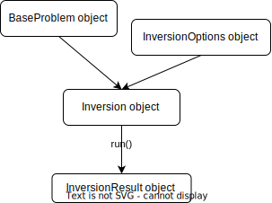

.. _api:

List of functions and classes (API)
===================================

.. automodule:: cofi

.. attention::

    This package is still under initial development stage, so public APIs are 
    not expected to be stable. Please stay updated and don't hesitate to raise
    feedback or issues through `GitHub issues <https://github.com/inlab-geo/cofi/issues/new/choose>`_ 
    or `Slack workspace <https://inlab-geo.slack.com>`_.

APIs for Basic Usage
--------------------

A typical inversion run in :code:`cofi` involves the following four objects:

:BaseProblem: base class of all forward problems that includes methods you
    can use to define a forward problem
:InversionOptions: a holder for you to define how you'd like the inversion
    problem to be solved
:Inversion: takes in both of above objects and can be thought of as a running
    engine
:InversionResult: a return object by :code:`Inversion.run()` (you won't need to 
    define this explicitly)

The "object" here is simply a variable, but more flexible and powerful than an 
integer or string, in the sense that they can have properties and methods attached
to them. In the following pages we expand what are available for each of the class
object we mention above, and how to use them.

.. autosummary::
    :toctree: generated/

    cofi.BaseProblem
    cofi.InversionOptions
    cofi.Inversion
    cofi.InversionResult

APIs for Advanced Usage
-----------------------

**BaseSolver** is the base class of all backend inversion tools. To plug in your own inversion
tools, simply create a subclass of :code:`BaseSolver` and implements :code:`__init__()` and 
:code:`__call__()`. Expand the details below for more concrete examples.

.. autosummary::
    :toctree: generated/

    cofi.solvers.BaseSolver
