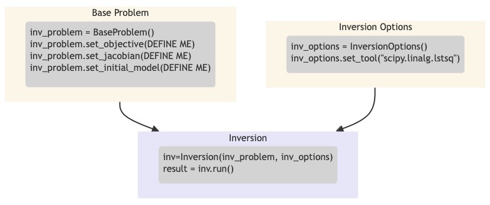

*************
What is CoFI?
*************

CoFI's mission is to provide a flexible and accessible platform that enables users to 
switch seamlessly between different algorithms and problems, with minimal changes.
CoFI provides an interface across a wide range of inference algorithms from different 
sources, underpinned by a rich set of domain relevant 
`examples <examples/generated/index.html>`_.

Whether you're a student seeking to deepen your understanding of geoscience, an 
educator aiming to provide practical and hands-on experiences, or an industry 
professional looking for a robust and adaptable tool, CoFI is designed with you in 
mind. It allows for a wide range of applications, from academic research and teaching 
to solving real-world geoscience problems in the industry. 

  
    CoFI Workflow

In the workflow of :code:`cofi`, there are three main
components: :code:`BaseProblem`, :code:`InversionOptions`, and :code:`Inversion`.

- :code:`BaseProblem` defines the inverse problem including any user supplied quantities such as data
  vector, number of model parameters and measure of fit between model predictions and data.

  .. code::

    inv_problem = BaseProblem()
    inv_problem.set_objective(some_function_here)     # if needed
    inv_problem.set_jacobian(some_function_here)      # if needed
    inv_problem.set_initial_model(a_starting_point)   # if needed
    # more could be set here
    # choose depending on the problem and how you want to solve it
    inv_problem.summary()

- :code:`InversionOptions` describes details about how one wants to run the inversion, including the backend
  tool and solver-specific parameters. It is based on the concept of a method and tool.

  .. code::

    inv_options = InversionOptions()
    inv_options.suggest_solving_methods()
    inv_options.set_solving_method("matrix solvers")
    inv_options.suggest_tools()
    inv_options.set_tool("scipy.linalg.lstsq")
    inv_options.summary()

- :code:`Inversion` can be seen as an inversion engine that takes in the above two as information,
  and will produce an :code:`InversionResult` upon running.

  .. code::
    
    inv = Inversion(inv_problem, inv_options)
    inv_result = inv.run()
    inv_result.summary()

.. hint::

  Congrats! You are on board. Click `here <installation.html>`_ if you haven't 
  installed CoFI locally yet. Otherwise, continue with 
  `tutorials <tutorials/generated/index.html>`_ for a step-by-step guide, or 
  `example gallery <examples/generated/index.html>`_ if you are eager to learn
  through examples.
